```mermaid
classDiagram
    %% Core LLM Abstraction Layer
    class LLMProvider {
        <<Interface>>
        +generateResponse(prompt: string, options: LLMOptions): Promise~LLMResponse~
        +streamResponse(prompt: string, options: LLMOptions): AsyncGenerator~LLMChunk~
        +generateStructuredOutput(prompt: string, schema: JSONSchema, options: LLMOptions): Promise~any~
    }

    class LLMOptions {
        +temperature: number
        +maxTokens: number
        +tools: Tool[]
        +systemPrompt: string
        +model: string
        +responseFormat: ResponseFormat
    }

    class ResponseFormat {
        +type: string
        +schema: JSONSchema
    }

    class LLMResponse {
        +content: string
        +toolCalls: ToolCall[]
        +usage: TokenUsage
    }

    class LLMChunk {
        +content: string
        +toolCallsInProgress: ToolCallInProgress[]
        +isComplete: boolean
    }

    class ToolCall {
        +name: string
        +arguments: object
        +id: string
    }

    class Tool {
        +name: string
        +description: string
        +parameters: JSONSchema
        +required: boolean
    }

    class ToolCallInProgress {
        +id: string
        +name: string
        +argumentsPartial: string
    }

    %% Concrete LLM Implementations
    class OpenAIProvider {
        -apiKey: string
        -client: OpenAIClient
        -convertToolsToFunctions(tools: Tool[]): Function[]
        -parseToolCalls(rawToolCalls: any[]): ToolCall[]
        +generateResponse(prompt: string, options: LLMOptions): Promise~LLMResponse~
        +streamResponse(prompt: string, options: LLMOptions): AsyncGenerator~LLMChunk~
        +generateStructuredOutput(prompt: string, schema: JSONSchema, options: LLMOptions): Promise~any~
    }

    class ClaudeProvider {
        -apiKey: string
        -client: AnthropicClient
        -convertToolsToAnthropicTools(tools: Tool[]): AnthropicTool[]
        -parseToolCalls(rawToolCalls: any[]): ToolCall[]
        +generateResponse(prompt: string, options: LLMOptions): Promise~LLMResponse~
        +streamResponse(prompt: string, options: LLMOptions): AsyncGenerator~LLMChunk~
        +generateStructuredOutput(prompt: string, schema: JSONSchema, options: LLMOptions): Promise~any~
    }

    class OllamaProvider {
        -endpoint: string
        -client: OllamaClient
        -formatToolsForOllama(tools: Tool[]): string
        -parseToolCalls(response: string): ToolCall[]
        +generateResponse(prompt: string, options: LLMOptions): Promise~LLMResponse~
        +streamResponse(prompt: string, options: LLMOptions): AsyncGenerator~LLMChunk~
        +generateStructuredOutput(prompt: string, schema: JSONSchema, options: LLMOptions): Promise~any~
    }

    class LLMProviderAdapter {
        <<Interface>>
        +adaptTool(tool: Tool): any
        +adaptOptions(options: LLMOptions): any
        +adaptResponse(response: any): LLMResponse
        +adaptStreamChunk(chunk: any): LLMChunk
    }

    %% LLM Factory
    class LLMFactory {
        +createProvider(type: string, config: object): LLMProvider
    }

    %% Message and Conversation Management
    class Message {
        +role: string
        +content: string
        +toolCalls?: ToolCall[]
        +toolResults?: any[]
    }

    class Conversation {
        -messages: Message[]
        -systemPrompt: string
        +addMessage(message: Message): void
        +getMessages(): Message[]
        +setSystemPrompt(prompt: string): void
        +getSystemPrompt(): string
        +getFullHistory(): Message[]
        +clear(): void
    }

    %% Prompt Management
    class PromptTemplate {
        -template: string
        -variables: string[]
        +compile(variables: Record~string, any~): string
        +getVariables(): string[]
    }

    %% Relationships
    LLMProvider <|-- OpenAIProvider
    LLMProvider <|-- ClaudeProvider
    LLMProvider <|-- OllamaProvider

    LLMProviderAdapter <|.. OpenAIProvider
    LLMProviderAdapter <|.. ClaudeProvider
    LLMProviderAdapter <|.. OllamaProvider

    LLMFactory --> LLMProvider : creates

    Conversation *-- Message : contains

    LLMOptions *-- Tool : includes
    LLMOptions *-- ResponseFormat : includes
    LLMResponse *-- ToolCall : includes
    LLMChunk *-- ToolCallInProgress : includes
```

# LLM Abstraction Layer Implementation with LangChain

## Task

Implement a model-agnostic LLM abstraction layer using LangChain.js with the following requirements:

1. Create a unified interface supporting OpenAI, Claude, and Ollama models
2. Implement standardized tool calling across all providers
3. Support structured output generation using JSON schema
4. Include streaming response capability

## Implementation Details

- Use LangChain's `ChatModel` interfaces for provider abstraction
- Implement the `StructuredTool` class for cross-provider tool definitions
- Use output parsers for structured response handling
- Include proper error handling and type definitions
- Provide simple examples for each capability

## Dependencies

```
npm install langchain @langchain/openai @langchain/anthropic @langchain/community zod
```


