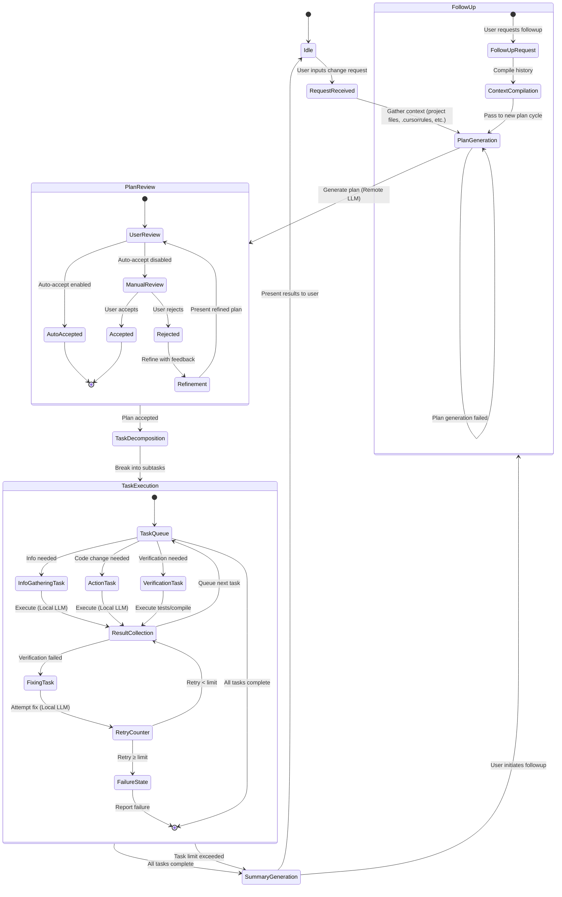
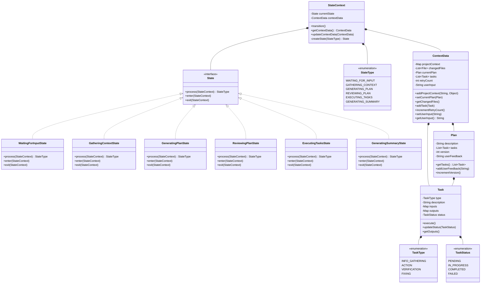

# Developer CLI Implementation Specification

1. **State Management**: The CLI must be built on top of the state machine that transitions between user input processing, context gathering, planning, execution, and follow-up stages, etc... It must be extensible and modifiable.

2. **Context Gathering**: When receiving a user request, gather comprehensive context including relevant project files, directory structure, dependencies, and any `.cursorrules` file content.

3. **Plan Generation**: Use remote LLMs (higher accuracy) for generating execution plans based on user requests and gathered context.

4. **Plan Review Process**:
    - Support both automatic and manual plan approval
    - Implement feedback loop for plan refinement when rejected
    - Use previous plan and user comments as context for refinement

5. **Task Decomposition**:
    - Break approved plans into executable subtasks (info gathering, action, verification)
    - Ensure subtasks have well-defined inputs and outputs for local LLM execution

6. **Task Execution**:
    - Prioritize local LLMs for subtask execution to optimize performance
    - Implement context passing between sequential tasks
    - Support information gathering tasks that feed into subsequent tasks

7. **Verification & Recovery**:
    - Implement verification tasks (compilation, tests) with clear success/failure states
    - Support automatic fix attempts when verification fails
    - Enforce retry limits (5-10 attempts) to prevent infinite loops

8. **Summary Generation**:
    - Create comprehensive summaries of executed tasks and changes
    - Track modified files for inclusion in follow-up context

9. **Follow-up Support**:
    - Allow seamless follow-up requests that build on previous context
    - Include execution history and changed files in follow-up context

